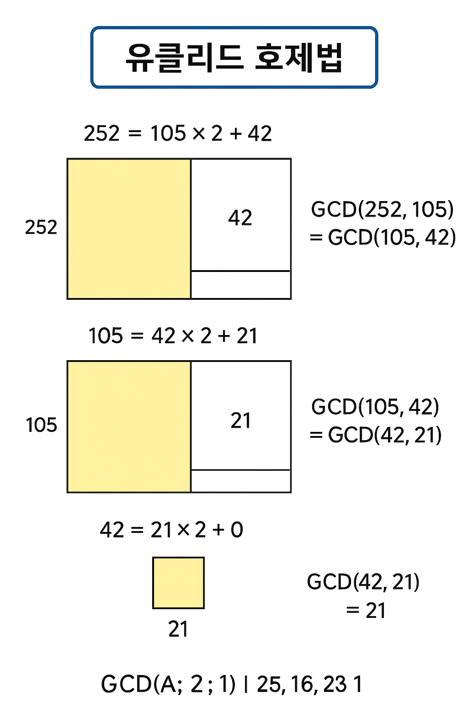

# 5. **두 수의 나눗셈** (Lv.0)

https://school.programmers.co.kr/learn/courses/30/lessons/120806

---

**💡문제 풀이**

```java
class Solution {
    public int solution(int num1, int num2) {
        int answer = (int)(((double)num1 / num2) * 1000);
        return answer;
    }
}
```

# 6. **숫자 비교하기** (Lv.0)

https://school.programmers.co.kr/learn/courses/30/lessons/120807

---

**💡문제 풀이**

```java
class Solution {
    public int solution(int num1, int num2) {
        int answer = num1 == num2 ? 1 : -1;
        return answer;
    }
}
```

# 7. 분수의 덧셈(유클리드 호제법) (Lv.0)

https://school.programmers.co.kr/learn/courses/30/lessons/120808

---

**💡문제 풀이**

- 내 문제 풀이
  ```java
  class Solution {
      public int[] solution(int numer1, int denom1, int numer2, int denom2) {
          int result_num = numer1*denom2 + numer2*denom1;//분자
          int result_denom = denom1*denom2;//분모

          int gcd = gcd(result_num, result_denom);//최대공약수

          return new int[] {result_num/gcd, result_denom/gcd};
      }

  //  유클리도 호제법을 이용한 최대공약수 구하기
      public static int gcd(int num1, int num2){
          while(num1 % num2 != 0)
          {
              int tmp = num1 % num2;
              num1 = num2;
              num2 = tmp;
          }

          return num2;
      }
  }
  ```

---

</aside>

# 📘 유클리드 호제법 (Euclidean Algorithm)

👉 **정의**

두 수 `A`, `B` (A > B)의 **최대공약수(GCD)**를 구하는 방법.

핵심 아이디어는

```
GCD(A, B) = GCD(B, A % B)
```

즉, 큰 수를 작은 수로 나눈 **나머지**로 계속 대체하다가

나머지가 `0`이 되는 순간의 나누는 수가 최대공약수!

---

## 예시: GCD(252, 105)

### 1단계

```
252 ÷ 105 = 2 ... 42
```

- 252 = 105 × 2 + 42
- 따라서 GCD(252, 105) = GCD(105, 42)

---

### 2단계

```
105 ÷ 42 = 2 ... 21
```

- 105 = 42 × 2 + 21
- 따라서 GCD(105, 42) = GCD(42, 21)

---

### 3단계

```
42 ÷ 21 = 2 ... 0
```

- 42 = 21 × 2 + 0
- 나머지가 0 → **최대공약수는 21**

---

## 그림으로 이해하기

📐 **직사각형 자르기 방법**

252 × 105 크기의 직사각형에서,

가장 큰 정사각형(한 변의 길이가 B=105)을 잘라내고 남은 부분으로 반복.



→ 105 × 105 정사각형 2개 잘라내고, 나머지 직사각형 크기는 105 × 42.

→ 다시 같은 방법 반복.

→ 마지막에 남는 정사각형 크기가 **21 × 21** → 최대공약수는 21.

---

✅ 요약

- 나눗셈 반복: **GCD(A, B) = GCD(B, A % B)**
- 나머지가 0이 되면 그때의 나누는 수가 최대공약수
- 직사각형 잘라내는 그림으로 직관적 이해 가능

---

# 8. **배열 두 배 만들기** (Lv.0)

https://school.programmers.co.kr/learn/courses/30/lessons/120809

---

**💡문제 풀이**

```java
class Solution {
    public int[] solution(int[] numbers) {
        int[] answer = new int[numbers.length];

        for(int i = 0; i < numbers.length; i++){
            answer[i] = numbers[i] * 2;
        }

        return answer;
    }
}
```
